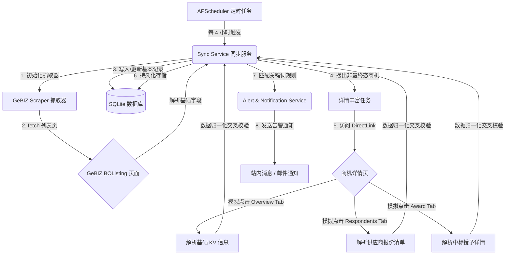

# GeBIZ 招投标自动化数据抓取技术方案说明书

本说明书详细阐述了 GeBIZ（新加坡政府采购网）商机自动监测与跟进系统的数据抓取技术方案。该方案重点解决了复杂 JavaServer Faces (JSF) / PrimeFaces 动态前端架构下的动态 Tab 切换、AJAX 数据延迟加载以及数据高容错解析等难点，确保了数据同步的稳定性、准确性与增量更新效率。

---

## 1. 总体架构设计

系统采用基于 Python 的轻量级异步抓取流水线，核心技术栈包括 **Playwright (Python)** 作为动态渲染引擎，**SQLAlchemy + SQLite** 作为存储，并引入 **APScheduler** 实现定时轮询。

以下为系统的整体数据流向与组件交互架构：



---

## 2. 双阶段抓取策略 (Two-Phase Scraping)

为了兼顾“快速抓取”与“深度解析”，系统采用了独特的**双阶段抓取机制**：

### 阶段一：列表页轻量化同步 (BOListing Scrape)
该阶段的目标是**以最低的开销获取全量商机编号及其当前状态的变更**。

1. **入口 URL**:
   `https://www.gebiz.gov.sg/ptn/opportunity/BOListing.xhtml?origin=opportunities`
2. **状态感知**:
   系统不仅解析当前活跃的 `Open` 商机，还会通过 Playwright 点击 `Closed` 大分类选项卡，再点击子选项卡切换至 `Closed`、`Pending Award`、`Awarded`、`Cancelled` 和 `No Award` 各子状态列表。
3. **输出字段**:
   - 商机文件编号 (`document_no`，用于唯一主键)
   - 发布日期 (`published_date`)
   - 截止日期 (`closing_at`)
   - 估算商机类型 (`opportunity_type`，根据单号特征提取)
   - 对应标签页归属状态 (`status`)

### 阶段二：详情页动态穿透丰富 (Detail Enrichment)
在获取了商机基础数据后，同步服务会对**非最终状态**（如 `Open`、`Closed`、`PendingAward`）的商机进行深度的“详情页穿透抓取”。

1. **直达 URL**:
   `https://www.gebiz.gov.sg/ptn/opportunity/directlink.xhtml?docCode={document_no}`
   *通过直达 URL 直接跳过列表检索，将单次详情页拉取耗时控制在最小范围。*
2. **多 Tab 数据穿透（技术难点）**:
   GeBIZ 详情页的 Tab 标签内容在初始 HTML 加载时并未渲染进 DOM，而是采用 **PrimeFaces AJAX** 机制延迟拉取。系统通过 Playwright 实现了以下的动态穿透：
   - **Overview 标签页 (默认激活)**: 解析联系人、采购类别、以及最终截止精确时间。
   - **Respondents 标签页**: 模拟定位包含 `"Respondents ("` 的标签并点击，等待 AJAX 渲染 2 秒，注入高性能的提取脚本，获取投标商名称、报价。
   - **Award 标签页 (仅 Awarded 状态存在)**: 模拟定位包含 `"Award ("` 的标签并点击，等待渲染，抓取官方授予的供应商、授予额度、授予日期。

---

## 3. 动态交互与容错解析实现

### 3.1 动态 AJAX Tab 点击方案
由于 GeBIZ 的选项卡加载有延迟，我们通过 Playwright 的文本正则表达式（Regex）结合内置的等待机制，设计了高健壮性的定位点击链条：

```python
# 1. 查找并点击 Respondents 标签页
respondents_tab = page.get_by_text(re.compile(r"Respondents \("))
if await respondents_tab.count() > 0:
    await respondents_tab.first.click()
    # 等待 AJAX 动态数据成功更新至 DOM
    await page.wait_for_timeout(2000) 
    
    # 2. 注入高容错性的 DOM 提取 JS 脚本
    respondents_data = await page.evaluate(JS_EXTRACTOR_FOR_RESPONDENTS)
```

### 3.2 智能表格解析引擎 (JS DOM Evaluator)
由于 GeBIZ 页面在不同状态或不同项目类型下，表格的列名、顺序可能发生细微变化（如列头可能是 "Supplier Name"、"Name of Respondent" 甚至 "Company"），解析脚本引入了**关键字模糊匹配与坐标定位**的机制：

```javascript
// JS_EXTRACTOR_FOR_RESPONDENTS 核心算法逻辑
() => {
  const list = [];
  const tables = [...document.querySelectorAll('table')];
  for (const table of tables) {
      const headers = [...table.querySelectorAll('th')].map(h => (h.innerText||'').trim().toLowerCase());
      
      // 1. 模糊定位“供应商名称”所在列的索引
      const nameIdx = headers.findIndex(h => 
          h.includes('supplier') || h.includes('name of') || 
          h.includes('respondent') || h.includes('tenderer') || h.includes('company')
      );
      
      // 2. 模糊定位“报价金额”所在列的索引
      const priceIdx = headers.findIndex(h => 
          h.includes('amount') || h.includes('price') || 
          h.includes('offer') || h.includes('evaluated') || h.includes('value')
      );
      
      if (nameIdx !== -1) {
          const rows = [...table.querySelectorAll('tbody tr')];
          for (const row of rows) {
              const cells = [...row.querySelectorAll('td')].map(c => (c.innerText||'').trim());
              if (cells.length > nameIdx && cells[nameIdx]) {
                  const supplierName = cells[nameIdx];
                  let amount = null;
                  
                  // 3. 仅当价格列存在且有值时，清洗格式并转换为浮点数（CLOSED 下无价格，自然保留为 null）
                  if (priceIdx !== -1 && cells.length > priceIdx) {
                      const cleanPrice = cells[priceIdx].replace(/[^0-9.]/g, '');
                      if (cleanPrice) amount = parseFloat(cleanPrice);
                  }
                  
                  list.push({
                      supplier_name: supplierName,
                      amount: amount,
                      is_awarded: false
                  });
              }
          }
      }
  }
  return list;
}
```

### 3.3 中标数据交叉比对
在 `Awarded` 状态下，系统会从 `Award` Tab 提取出中标供应商名称。为了将报价清单与最终授予结果紧密结合，系统会在 Python 后端执行**交叉归一化比对**：

```python
# 提取中标详情
awarded_supplier = award_details.get("supplier_name")
award_amount = award_details.get("amount")

# 遍历 Respondents 列表进行状态合并
matched = False
for resp in respondents_data:
    if resp["supplier_name"].lower() == awarded_supplier.lower():
        resp["is_awarded"] = True
        matched = True
        if award_amount and not resp.get("amount"):
            resp["amount"] = award_amount

# 极端情况兜底：若中标供应商未在投标清单中显现，则动态补录至列表
if not matched:
    respondents_data.append({
        "supplier_name": awarded_supplier,
        "amount": award_amount,
        "is_awarded": True
    })
```

---

## 4. 数据库持久化结构设计

抓取的数据在保存时映射为以下两张核心关系型数据库表（基于 SQLite）：

### 4.1 商机主表 `opportunities`
存储商机的基础元数据以及富文本描述与最终中标快照。

| 字段名 | 类型 | 说明 |
| :--- | :--- | :--- |
| `document_no` (PK) | VARCHAR(64) | 官方文件编号，唯一键 |
| `reference_no` | VARCHAR(64) | 官方参考号 / 招标单号 |
| `opportunity_type` | ENUM | 商机类型 (Tender, Quotation 等) |
| `status` | ENUM | 状态 (Open, Closed, Awarded 等) |
| `published_date` | DATE | 发布日期 |
| `closing_at` | DATETIME | 截止精确时间 |
| `award_details` | JSON | 中标详情快照 (`supplier_name`, `amount`, `date`) |

### 4.2 投标清单从表 `opportunity_respondents`
级联存储项目在 `CLOSED`、`PENDING AWARD`、`AWARDED` 状态下提取到的每一个投标商及其报价详情。

| 字段名 | 类型 | 说明 |
| :--- | :--- | :--- |
| `id` (PK) | INTEGER | 自增主键 |
| `document_no` (FK) | VARCHAR(64) | 外键，关联主表 `document_no` (支持级联删除) |
| `supplier_name` | VARCHAR(256) | 投标供应商名称 |
| `amount` | FLOAT (Nullable) | 报价金额（CLOSED 下为 NULL，PENDING/AWARDED 下有值） |
| `is_awarded` | BOOLEAN | 是否中标（默认 FALSE，交叉校验后更新为 TRUE） |

---

## 5. 防爬伪装与健壮性策略

1. **语言区域模拟 (Locale Emulation)**:
   在新建浏览器上下文时指定特定的 Locale 为 `en-SG`，防止由于服务端语言检测返回不同的日期格式（如把 `22 Apr 2026` 格式化为其他本地语言导致正则解析失效）。
2. **高保真浏览器头 (User-Agent Spoofer)**:
   模拟主流的 Windows Chrome 环境，防范 GeBIZ 基于 WAF 或静态特性的自动阻断。
3. **断网与限速容错**:
   详情页丰富阶段涉及多次详情页打开与选项卡点击操作。在 Playwright 中配置了最多 3 次的主动重试间隔，并为每一个标签页操作设计了独立的 `try-except` 异常隔离保护，防止单次请求超时或单个商机 DOM 渲染结构异常导致整个同步批次中断。
